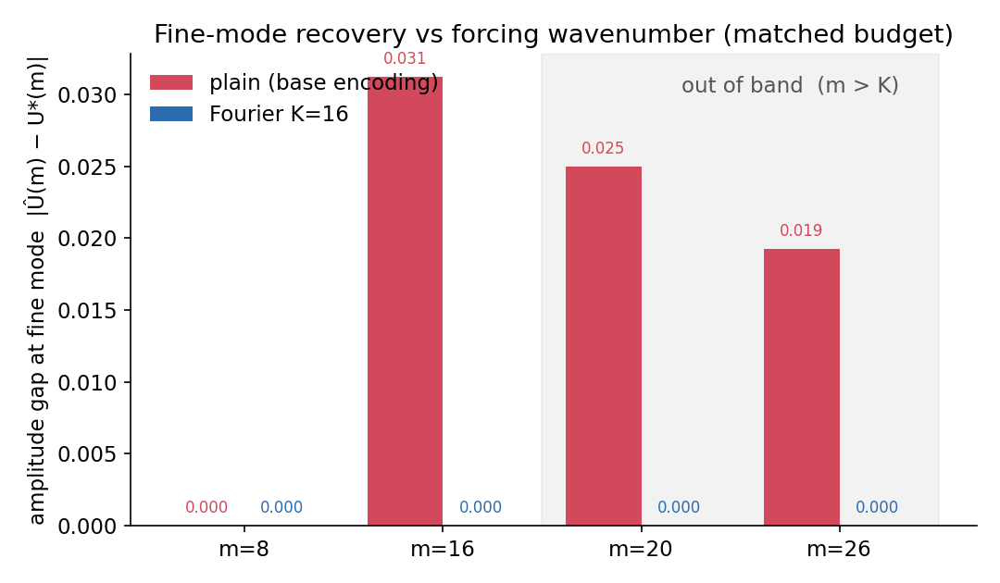
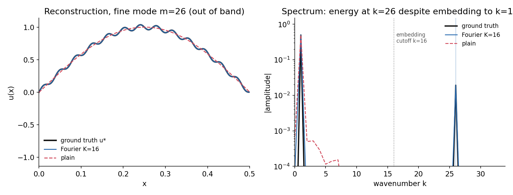
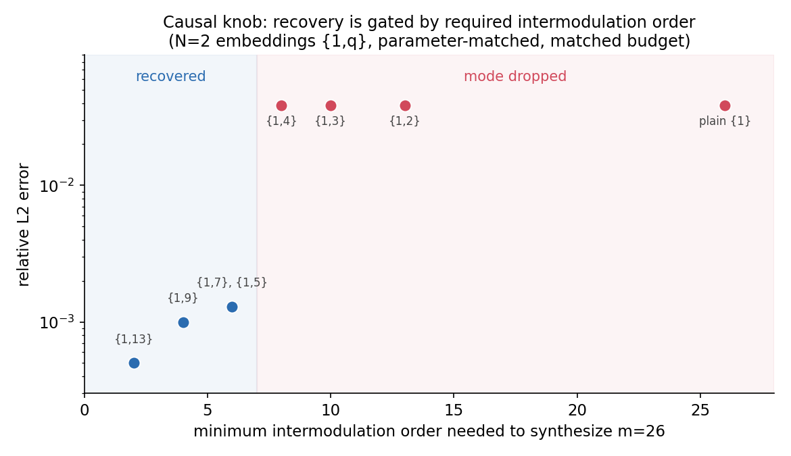

# Out-of-band stress test: does the Fourier advantage survive forcing above the embedding band?

The spectral-bias demo (`pinn_spectral_bias.py`) placed the target's fine mode at
m = 15, inside a K = 16 harmonic embedding. That invites a sharp question: does
the Fourier-feature advantage hold when the PDE forcing injects a wavenumber
*above* the embedding band, or is the result merely that the benchmark spectrum
was put inside the embedded frequencies? The answer separates genuinely
transferable multiscale learning from a representation pre-aligned with the
target spectrum. This is that test.

## Setup

Same model and training as the demo. The Fourier embedding is held fixed at
K = 16 harmonics, `[sin 2pi k x, cos 2pi k x]` for k = 1..K. We move the target's
fine mode m across the band edge and, for each m, compare `plain` (base periodic
encoding) against `fourier(K=16)` at a matched budget (1800 Adam steps, one
seed). In band is m <= 16; out of band is m > 16, reaching m = 26, ten harmonics
above the top embedded frequency. The first-order operator u'(x) = g(x) keeps the
two source modes equally weighted in the residual, so the test isolates the
representation from the operator's own spectral weighting. Metric: the amplitude
gap at the fine mode, `|U_hat(m) - U_star(m)|`, plus the global relative L2.



## Results (measured, CPU, one seed)

| m  | band | plain, gap at m | Fourier K=16, gap at m | true amplitude 1/m | plain rel L2 | Fourier rel L2 |
|----|------|-----------------|------------------------|--------------------|--------------|----------------|
|  8 | in   | 0.00001         | 0.000002               | 0.1250             | 0.00041      | 0.00015        |
| 16 | in   | 0.03125         | 0.000002               | 0.0625             | 0.06257      | 0.000085       |
| 20 | OUT  | 0.02500         | 0.0000007              | 0.0500             | 0.05082      | 0.00014        |
| 26 | OUT  | 0.01923         | 0.0000009              | 0.0385             | 0.03853      | 0.00011        |

Read the plain row against the true amplitude: from m = 16 on, the plain baseline
recovers only about half the fine component in band (gap 0.031 vs amplitude
0.0625) and essentially drops it out of band, where its rel L2 tracks the mode's
own amplitude (the fine component is all but absent). The Fourier network closes
the gap to within rounding at every m, in band and out of band alike, holding
rel L2 near 1e-4 even at m = 26.

## Why it transfers: the mechanism, shown in the spectrum



The right panel is the mechanism made visible. The embedding supplies harmonics
only up to k = 16 (dotted cutoff), yet the trained Fourier network places the
correct amount of energy at k = 26. A stack of tanh layers over an oscillatory
basis produces intermodulation products: sums and differences of the embedded
harmonics synthesize wavenumbers well above K. The embedding therefore does not
act as a hard low-pass on the representable set. It seeds oscillatory building
blocks at roughly the right scale, and the optimizer reaches the high mode at
matched budget instead of crawling toward it the way the plain net does.
Widening K to cover the mode is not required for the recovery; in the sweep it
only sharpens conditioning.

## Causal ablation: which variable actually gates recovery

Is the out-of-band recovery caused by the presence of harmonics that can
synthesize the target through intermodulation? The direct test is a
frequency-subset ablation at fixed parameter count and budget.

First, the naive form of the test does not bite. Holding the embedding at N = 8
frequencies (identical parameter count) and removing the specific pairs that sum
to 26, the network still recovers the mode:

| embedding (N=8 unless noted) | route to 26 at low order | gap at m=26 | rel L2 |
|------------------------------|--------------------------|-------------|--------|
| plain base {1}               | no (needs order 26)      | 0.0192      | 0.0385 |
| K=16 full {1..16}            | yes                      | 0.0000      | 0.0001 |
| {1..8}                       | no (2nd-order max 16)    | 0.0000      | 0.0004 |
| {1..6, 13}                   | yes (2x13)               | 0.0000      | 0.0002 |
| {1..6, 10, 16}               | yes (10+16)              | 0.0000      | 0.0001 |
| {1..6, 11, 15}               | yes (11+15)              | 0.0000      | 0.0002 |
| {9..16} (no fundamental)     | yes                      | 0.0000      | 0.0002 |

Every parameter-matched embedding recovers m = 26, including {1..8} with no
second-order route and {9..16} with no fundamental at all (it rebuilds the
dominant low mode from differences). A four-layer tanh stack reaches 26 through
many redundant higher-order intermodulation routes, so pulling one combination
changes nothing.

The variable that is causal is the minimum intermodulation order required to
synthesize the target from the embedded band. Holding capacity at N = 2 embeddings
{1, q} and raising that order through the choice of q:

| embedding | min order to 26 | rel L2 | outcome |
|-----------|-----------------|--------|---------|
| {1, 13}   | 2               | 0.0005 | recovered |
| {1, 9}    | 4               | 0.0010 | recovered |
| {1, 7}    | 6               | 0.0013 | recovered |
| {1, 5}    | 6               | 0.0013 | recovered |
| {1, 4}    | 8               | 0.0386 | mode dropped |
| {1, 3}    | 10              | 0.0386 | mode dropped |
| {1, 2}    | 13              | 0.0386 | mode dropped |
| plain {1} | 26              | 0.0386 | mode dropped |



Recovery degrades predictably with the required order and collapses past a sharp
threshold near order 7 at this budget, where the error jumps to the mode's own
amplitude (the fine component is dropped entirely). Plain {1}, which must reach 26
as the 26th self-harmonic of a single frequency, is just the far end of the same
curve. So the mechanism is causal and it is spectral bias recursed: not a wall in
what the network can represent, but a rate law in the synthesis order the optimizer
has to climb. Moving the training budget moves the threshold. Scripts:
`ablation_m26.py` (frequency-subset) and `order_gradient.py` (order sweep).

## Scope

This is a controlled 1D, first-order, periodic setting with a single injected
fine mode and one seed. It isolates the representation question; it is not a
claim about arbitrary broadband multiscale PDEs. The reach beyond the band is via
nonlinear synthesis and depends on depth, width, and how far above K the mode
sits. The sweep shows robustness to m = 26, about 1.6x the band edge, but does
not locate the eventual failure point. Pushing m until recovery degrades maps
that boundary and is exactly the band-resolved metric carried over from the
kernel benchmark.

## Reproduce

```
python pinn/oob_stress.py
```

Deterministic (fixed seeds); a few minutes on CPU. Full results and the
band-resolved metrics are in the Zenodo record:
https://doi.org/10.5281/zenodo.22261321
