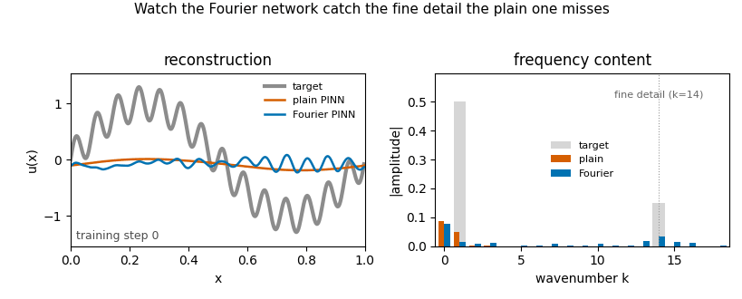

# Fourier vs plain PINN: catching the fine detail

The orange plain network stays smooth and blind to the fine ripple; the blue Fourier-feature network catches it. Press **Run** below to try your own settings.

An interactive version of the explainer from
[Fourier-Physics-Informed-NN](https://github.com/freshNfunky/Fourier-Physics-Informed-NN).
Train two physics-informed networks on the same multi-scale target and watch the
plain network stay blind to the fine high-frequency detail while the
Fourier-feature network captures it. Move the sliders and press Run.
